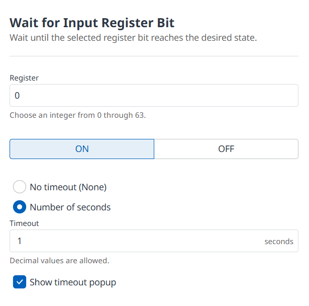
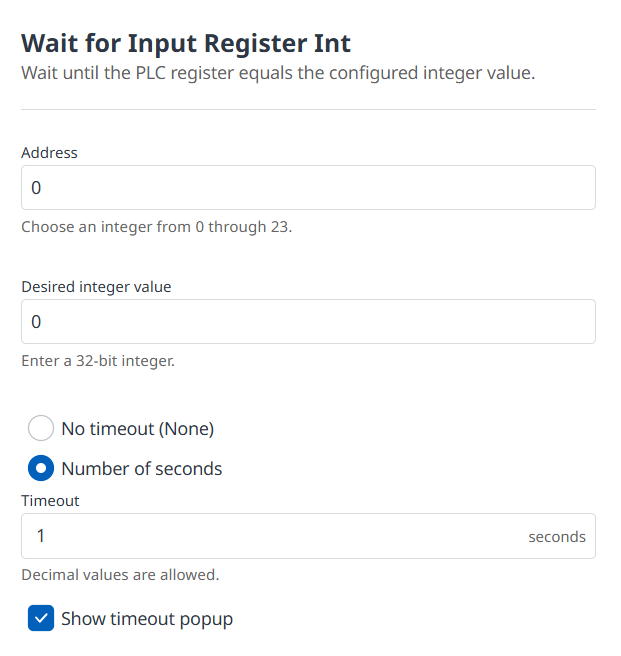
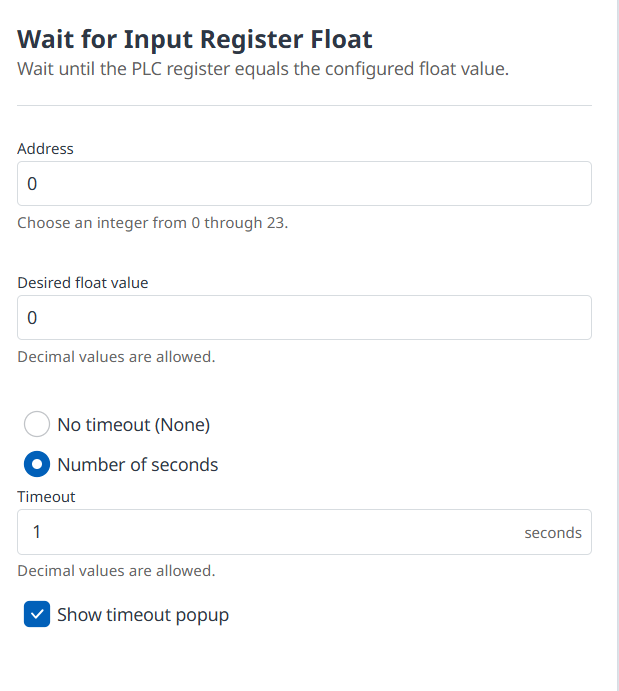
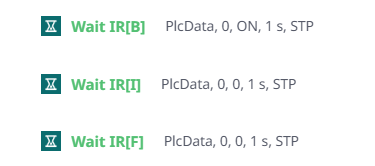

# PlcData


**PlcData** is a Doosan DART User Command V2 module from Zwart Industrial Innovations. It adds three PLC input-register wait commands to the Task Editor.

Current version: **0.0.1**  
Package name: `com.zii.plcdata`  
Target SDK: **6**

## Download

[Download PlcData 0.0.1 (`com.zii.plcdata_0.0.1.dm`)](release/com.zii.plcdata_0.0.1.dm)

SHA-256:

```text
718EC2F569730264BE015C0E95445DFAF23292C61E29C61FE11744668FFC231D
```

## Included commands

| Task Editor label | Function | Purpose |
|---|---|---|
| `Wait IR[B]` | `wait_input_register_bit(...)` | Wait for input-register bit 0-63 to become `ON` or `OFF`. |
| `Wait IR[I]` | `wait_input_register_int(...)` | Wait for input-register INT address 0-23 to equal a signed 32-bit integer. |
| `Wait IR[F]` | `wait_input_register_float(...)` | Wait for input-register FLOAT address 0-23 to exactly equal a decimal value. |

Each command supports an indefinite wait or a positive timeout in seconds. A timeout popup can be enabled for operator feedback.

## Property screens

### Input Register Bit



### Input Register Int



### Input Register Float



## Task-list summary



Example:

```text
PlcData, 0, ON, 1 s, STP
```

- `PlcData`: installed module name; it is not sent to the PLC.
- `0`: bit register or INT/FLOAT address.
- `ON`: desired bit state. INT and FLOAT commands show the desired numeric value here.
- `1 s`: timeout in seconds.
- `STP`: **Show Timeout Popup**. This does not mean “stop task”.

## Documentation

- [GitHub user manual](MANUAL.md)
- [Downloadable PDF manual](PlcData_User_Manual_v0.0.1.pdf)
- [Release notes](RELEASE_NOTES_0.0.1.md)
- [Changelog](CHANGELOG.md)

## Installation

1. Download the `.dm` file above.
2. If the former `com.zwart.wri` package is installed, remove it first to avoid two `PlcData` groups.
3. In DART-Platform, switch to the authority level required to install modules.
4. Select **Install Module** on the Home screen and choose the `.dm` file.
5. Open Task Editor, add a command, and browse to **User Commands > PlcData**.

Doosan's official workflow is documented in [Build and Install a Module](https://developers.drdart.io/guide/ver/pub/build-a-module).

## Supported interface languages

Dutch, English, German, Polish, Spanish, Italian, and Korean.

## Important

- These wait commands are not safety functions and must never replace safety-rated logic or emergency-stop circuitry.
- FLOAT uses exact equality. Ensure the PLC and robot use the same value representation.
- Validate register mapping, timeouts, and task behaviour in a safe test environment before production use.
- The Task Editor controls the generic green hourglass icon and may show the same icon for every User Command.

## Publisher

Copyright (c) 2026 Zwart Industrial Innovations.

## Support further development

Donations support further module development and are appreciated as a thank-you for the modules.

<a href="../assets/paypal-donation-qr.png"></a>


